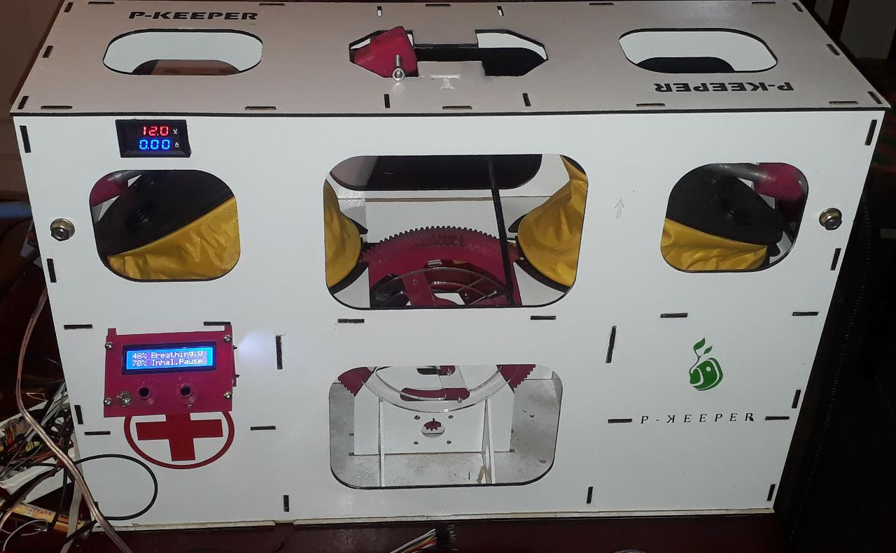
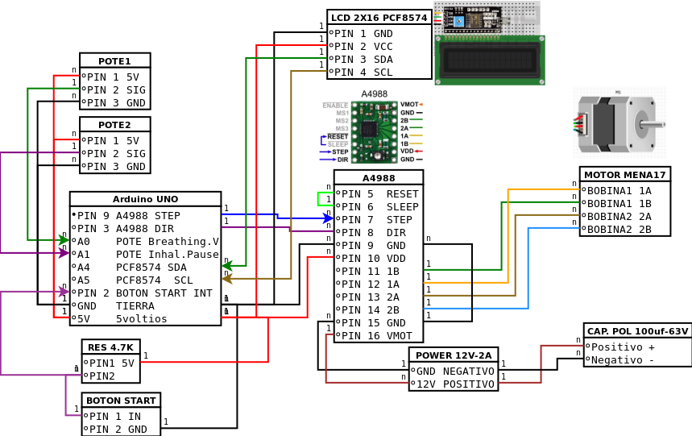

# P-Keeper
[thepkeeper.wordpress.com](https://thepkeeper.wordpress.com/)

## Respirador artificial para el COVID-19, Artificial respirator for COVID-19

# Que es P-Keeper?

Es un sistema de respiración asistida para contingencias, diseñado para ser producido en masa por cualquier empresa o emprendedor y con excelentes materiales disponibles pensados para durar pero no homologado ni avalado por ningún organismo de la salud a nivel mundial. Fue concebido para ayudar en la pandemia mundial del COVID-19 y en caso de extrema emergencia.

# Como Funciona?
## Todo respirador debe cumplir con los parametros:

- Volumen de ingreso de aire: de 6 a 8ml/kg.
- Presión de ingreso de aire: determinado por el medico.
- Frecuencia respiratoria: 10 a 20rpm regulable o programable
- Pausa entre inhalación y exhalación regulable.
- Posibilidad de extracción de aire si el paciente no puede exhalar por sus medios.

# Para lograr todos estos parametros P-KEEPER utiliza:

- 2 fuelles de 5lts de volumen máximo que pueden ser regulados hasta los 200ml, los cuales sirven: 1 para el ingreso de aire y otro para extracción del aire en el caso que el paciente no puede hacerlo por sus medios pero puede operar con solo 1 fuelle para la inhalación.
- 2 motores paso a paso, 1 capaz de aportar movimiento continuo las 24hs por 80 días antes de una revisión en sus rodamientos y el otro como sistema redundante de backup el cual está montado sobre el mismo eje y mide en todo momento el esfuerzo que el motor 1 realiza y cuando se sale de parámetros, se hace una conmutación para apagar un motor y arrancar el otro de manera instantánea y en la misma posición, mostrando con un led que el motor 1 está fuera de servicio .
- Sistema de control electrónico análogo para regular parámetros con simples potenciómetros, que regulan el tiempo de giro de los motores y frecuencias internas que permiten que el motor realice pausas en algún momento del recorrido.
- Ruedas de accionamientos.
- Levas de accionamiento regulables sobre las ruedas para poder regular el volumen de aire.
- Válvulas tipo diafragma para las mangueras y conexiones standard para cualquier manguera de respirador en el mercado.
- Cámara mezcladora de aire y oxigeno en el aspirado del fuelle.

# Funcionamiento?

El motor paso a paso, mueve por unos engranes y poleas la rueda de transmisión que tiene sujetas las levas de accionamiento que mueven los fuelles, uno sube cuando el otro baja y por ende, uno inyecta aire y el otro lo extrae del paciente, con unos potenciómetros se pueden regular las velocidades y pausas pero a su vez con tan solo un ajuste mecánico en la rueda de transmisión se puede graduar el volumen de aire que se quiere inyectar y extraer del paciente. También posee sistema de bateria de 12v que permiten mantener el funcionamiento por al menos 12hs sin conexión a la red eléctrica.

# Esquema Arduino

# Tu donacion es importante.

